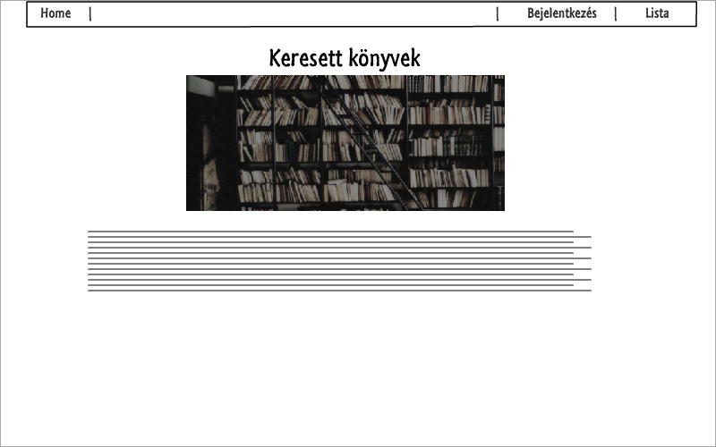
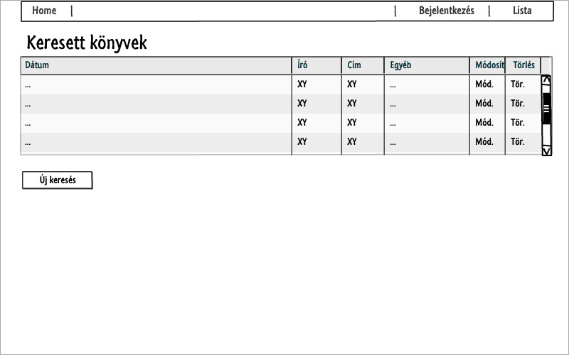
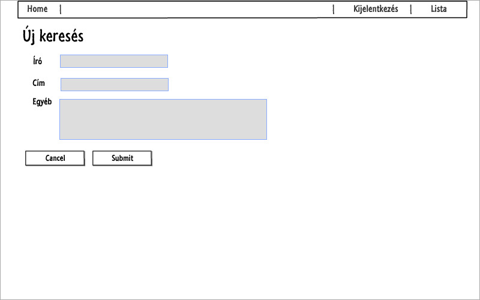
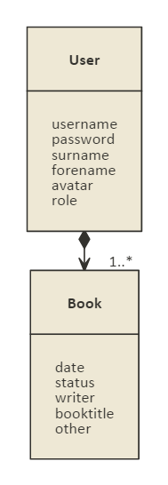
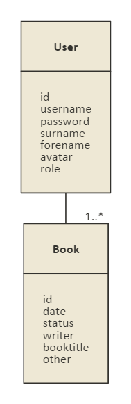
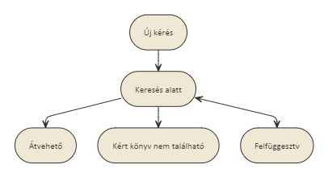

#Könyvkereső

##Követelményanalízis

1. Követelmények összegyűjtése

    - Funkcionális elvárások
        + Könyvkeresésre kérést lehet megadni
        + Korábbi kérések listáját meg lehet tekinteni
        + Korábbi kérés módosítása(könyv szerzőjének, címének, egyéb tulajdonságainak módosítása)
        + Korábbi kérés törlése
    
    - Nem funkcionális követelmények
        + Felhasználóbarát, ergonomikus elrendezés és kinézet
        + Gyors működés
        + Biztonságos működés: jelszavak tárolása, funkciókhoz való hozzáférés.

2. Használatieset-modell
    - Szerepkörök:
        + Vendég: Kezdőoldalt megnézheti, regisztrálni tud
        + Felhasználó: A vendég szerepkörén túl kérést tud leadni, és leadott kéréseit meg tudja tekinteni
    
    - Használati eset diagram:
        
    
    - Folyamatok pontos menete:
        + keresés felvitele
        + keresés módosítása
        + keresés törlése
        
        Keresés felvitelének folyamata:
            

##Tervezés

1. Architektúra terv
    - Komponensdiagram
    
    - Oldaltérkép
    
        + Publikus:
        
            - Főoldal
            - Bejelentkezés
        
        + Felhasználó
        
            - Főoldal
            - Bejelentkezés/Kijelentkezés
            - Kereséslista
                + új keresés
                + keresés módosítása
                + keresés törlése

    - Végpontok
        GET /: főoldal
        
        GET /login: bejelentkező oldal
        
        POST /login: bejelentkezési adatok felküldése
        
        GET /login/signup: regisztáló oldal
        
        POST /login/signup: regisztrálási adatok felküldése
        
        GET /books/list: kereséslista oldal
        
        GET /books/new: új keresés felvitele
        
        POST /books/new: új keresés felvitele, adatok küldése
        
        GET /books/:id: keresés adatait megváltoztató oldal
        
        POST /books/:id: megváltoztatott adatok felküldése
        
        GET /delete/:id: keresés törlése
        

2. Felhasználóifelület-modell
    - Oldalvázlatok
    
    
    
    

3. Osztálymodell
    - Adatmodell
    
        

    - Adatbázisterv
    
        
        
    - Állapotdiagram
    
        

4. Dinamikus működés
    - Szekvenciadiagram