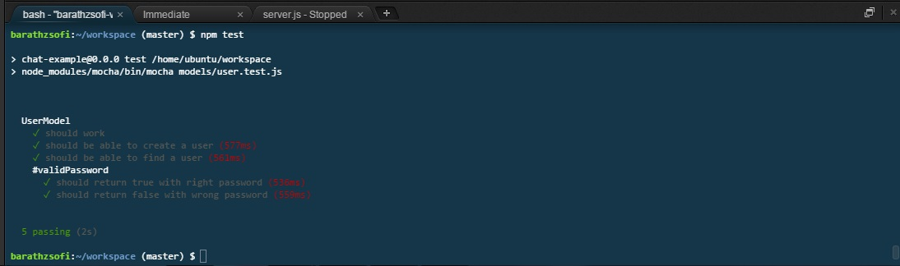

#Könyvkereső

##Követelményanalízis

1. Követelmények összegyűjtése

    - Funkcionális elvárások
        + Könyvkeresésre kérést lehet megadni
        + Korábbi kérések listáját meg lehet tekinteni
        + Korábbi kérés módosítása(könyv szerzőjének, címének, egyéb tulajdonságainak módosítása)
        + Korábbi kérés törlése
    
    - Nem funkcionális követelmények
        + Felhasználóbarát, ergonomikus elrendezés és kinézet
        + Gyors működés
        + Biztonságos működés: jelszavak tárolása, funkciókhoz való hozzáférés.

2. Használatieset-modell
    - Szerepkörök:
        + Vendég: Kezdőoldalt megnézheti, regisztrálni tud
        + Felhasználó: A vendég szerepkörén túl kérést tud leadni, és leadott kéréseit meg tudja tekinteni
    
    - Használati eset diagram:
        
    
    - Folyamatok pontos menete:
        + keresés felvitele
        + keresés módosítása
        + keresés törlése
        
        Keresés felvitelének folyamata:
            

##Tervezés

1. Architektúra terv
    - Komponensdiagram
    
    - Oldaltérkép
    
        + Publikus:
        
            - Főoldal
            - Bejelentkezés
        
        + Felhasználó
        
            - Főoldal
            - Bejelentkezés/Kijelentkezés
            - Kereséslista
                + új keresés
                + keresés módosítása
                + keresés törlése

    - Végpontok
        GET /: főoldal
        
        GET /login: bejelentkező oldal
        
        POST /login: bejelentkezési adatok felküldése
        
        GET /login/signup: regisztáló oldal
        
        POST /login/signup: regisztrálási adatok felküldése
        
        GET /books/list: kereséslista oldal
        
        GET /books/new: új keresés felvitele
        
        POST /books/new: új keresés felvitele, adatok küldése
        
        GET /books/:id: keresés adatait megváltoztató oldal
        
        POST /books/:id: megváltoztatott adatok felküldése
        
        GET /delete/:id: keresés törlése
        

2. Felhasználóifelület-modell
    - Oldalvázlatok
    
    
    
    

3. Osztálymodell
    - Adatmodell
    
        

    - Adatbázisterv
    
        
        
    - Állapotdiagram
    
        

##Implementáció
1. Fejlesztői környezet bemutatása
    Cloud 9 webes IDE, ahova Github accounttal való belépés után új workspacet hozhatunk létre (new workspace). Itt egy fájlt futtathatunk például a webes terminálablakból, a node fájlnév paranccsal. 
    
2. Könyvtárstruktúrában lévő mappák funkiójának bemutatása
    - config: A Waterline konfigurációja (Waterline adatbázis absztrakciós réteg, gyűjteményeket, modelleket, adaptereket tartalmaz)
    - controllers: A vezérlő. Folyamatirányítás, kérés fogadása, feldolgozása 
    - models: Modellek definiálása, adatok és feldolgozási logika
    - viewmodels: Nézetmodel
    - views: A kimenetért felelős rész, vagyis az egyes oldalak szerkezetét, kinézetét adja meg

##Tesztelés

1. Egységtesztek:

    User modell tesztelve (models/user.test.js)
    
    

2. Tesztesetek felsorolása

    - Felhasználó létrehozása
    - Keresés
    - ValidPassword metódus

##Felhasználói dokumentáció

1. Telepítés lépései: hogyan kerül a Githubról a célgépre a program
    
    Modell-nézet-vezérlő minta van alkalmazva, azaz az alkalmazásszerver ebből a három részből áll,
    a kliens az alkalmazásszervernek kérést add, amit először a vezérlő kap meg. Ez átadja a modellnek, ami az adatbázisból kéri le
    a szükséges adatokat. Ezután a kérés visszakerül a vezérlőhöz, az átadja a nézetnek, ahol a honlap szerkezetének kialakítása történik meg.
    Ezt követően nyílik meg az oldal.

2. A program használata
    
    Az almalmazás használatához regisztráció szükséges, amit a Bejelentkezés-nél lehet megtenni, a Regisztráció feliratú gombra kattintva.
    Regisztráció során a vezetéknevet, keresztnevet, felhasználónevet és a jelszót kötelező megadni. Regisztráció után automatikus a bejelentkeztetés.
    A keresett könyvek listáját megtekinteni, szerkeszteni a Keresett könyvek menüpontban lehet. Itt a keresések ki vannak listázva. Új keresést az Új könyv keresése gombbal lehet megadni,
    Ahol a könyv szerzőjét, címét kötelező megadni, illetve meg kell valamilyen tulajdonságot is a könyvvel kapcsolatban, a keresés konkrétabbá tételéhez,
    például hogy milyen nyelvű példányt keresünk, vagy melyik kiadást, vagy hogy maximálisan mennyit vagyunk hajlandóak fizetni érte. A submit gombra kattinta megtörténik az új keresés felvitele
    a submit gombra kattintva törlődnek a mezőkből a korábban beírt adatok.
    A kérés felvitele után újra a lista jön be. A keresés törléséhez a törölni kívánt sorban a Tör.-re kell kattintani, módosításhoz pedig a Mód.-ra.
    A törlés automatikusan megtörténik. Módosításhoz az új felvételéhez hasonló oldal jelenik meg, ahol meg lehet adni a módosítani kivánt tulajdonságokat.
    Csak az a tulajdonság módosul, amihez írunk valamit, a többi változatlan marad. Kijelentkezni a Kilépés menüponttal lehet.

