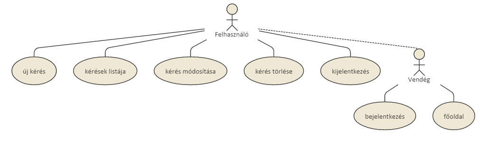

#Könyvkereső

##Követelményanalízis

1. Követelmények összegyűjtése:

    - Funkcionális elvárások
        + Könyvkeresésre kérést lehet megadni
        + Korábbi kérések listáját meg lehet tekinteni
        + Korábbi kérés módosítása(könyv szerzőjének, címének, egyéb tulajdonságainak módosítása)
        + Korábbi kérés törlése
    
    - Nem funkcionális követelmények
        + Felhasználóbarát, ergonomikus elrendezés és kinézet
        + Gyors működés
        + Biztonságos működés: jelszavak tárolása, funkciókhoz való hozzáférés.

3. Használatieset-modell
    - Szerepkörök:
        + Vendég: Kezdőoldalt megnézheti, regisztrálni tud
        + Felhasználó: A vendég szerepkörén túl kérést tud leadni, és leadott kéréseit meg tudja tekinteni
    
    - Használati eset diagram:
        
    
    - Folyamatok pontos menete:
        + keresés felvitele
        + könyv módosítása
        + könyv törlése
        
            

##Tervezés

1. Architektúra terv
    - Komponensdiagram
    - Oldaltérkép
    - Végpontok

2. Felhasználóifelület-modell
    - Oldalvázlatok

3. Osztálymodell
    - Adatmodell
    - Adatbázisterv
    - Állapotdiagram

4. Dinamikus működés